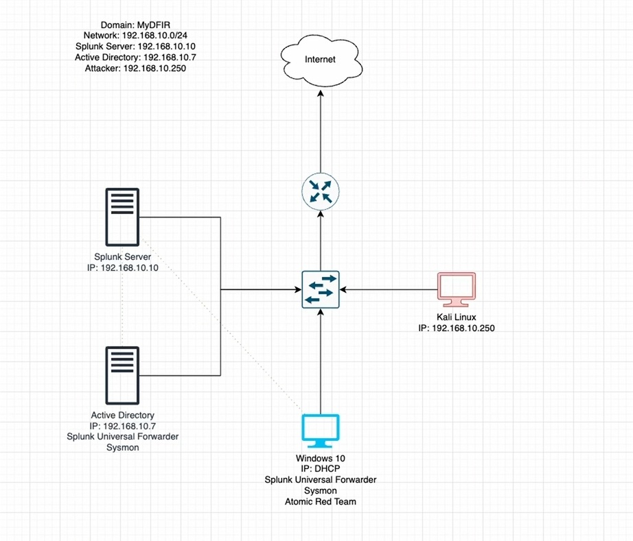

# Active Directory Home Lab

## Objective

The purpose of this project was to design and implement a virtualized Active Directory lab environment to simulate a real-world enterprise network. The lab was built to practice system administration, network segmentation, and security monitoring using centralized logging and attack simulation.

---

## Lab Architecture

This lab consists of:

- **Active Directory Domain Controller** (Windows Server)
- **Windows 10 Endpoint** (joined to the domain)
- **Kali Linux Attacker Machine**
- **Splunk Server** for centralized logging and analysis
- **Sysmon + Splunk Universal Forwarder** for endpoint telemetry

All systems are connected within a segmented **192.168.10.0/24 network**.

---

## Key Skills Demonstrated

- Active Directory deployment and domain configuration  
- Windows system administration and domain joining  
- SIEM implementation and log analysis (Splunk)  
- Endpoint monitoring using Sysmon  
- Network traffic analysis and attack detection concepts  
- Understanding of attacker behavior using Kali Linux  

---

## Tools & Technologies

### Operating Systems
- Windows Server (Active Directory)
- Windows 10
- Kali Linux

### Security & Monitoring
- Splunk (SIEM)
- Sysmon
- Splunk Universal Forwarder

### Networking
- Virtualized network (192.168.10.0/24)
- NAT / internal segmentation

---

## Implementation Steps

### 1. Environment Setup
- Installed virtualization software and created multiple virtual machines  
- Configured internal network (192.168.10.0/24)  
- Assigned static IPs to key systems (Domain Controller, Splunk, Kali)

---

### 2. Active Directory Configuration
- Installed and configured **Active Directory Domain Services (AD DS)**  
- Promoted server to Domain Controller  
- Created domain users and organizational structure  

---

### 3. Endpoint Integration
- Joined Windows 10 machine to the domain  
- Verified authentication and domain communication  

---

### 4. Security Monitoring Setup
- Installed **Sysmon** on endpoints for detailed logging  
- Installed **Splunk Universal Forwarder** on:
  - Domain Controller  
  - Windows 10 endpoint  
- Forwarded logs to Splunk server  

---

### 5. Attack Simulation & Detection
- Used **Kali Linux** to simulate attacker activity  
- Generated test events (login attempts, reconnaissance, etc.)  
- Observed and analyzed logs within Splunk  

---

## Key Takeaways

- Gained hands-on experience with enterprise-style Active Directory environments  
- Learned how centralized logging improves visibility into system activity  
- Developed foundational skills in detecting and analyzing suspicious behavior  
- Understood how attackers interact with networks and how logs reflect those actions  

---

## Future Improvements

- Create custom Splunk dashboards for threat detection  
- Implement alerting for suspicious activities  
- Expand lab with additional endpoints and services  
- Simulate more advanced attack techniques  

---
